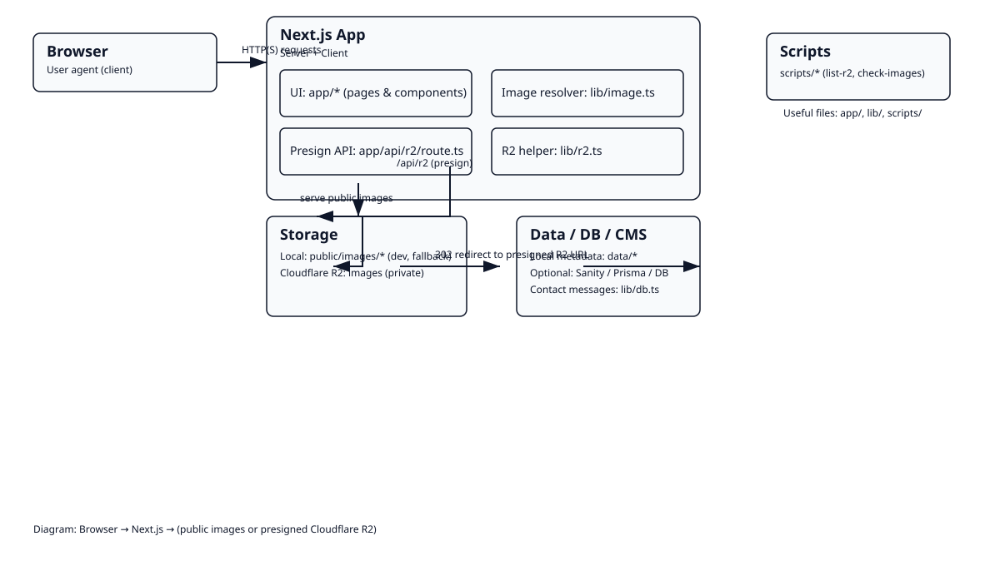

# Project Architecture — Viksphere Site

<!-- Visual architecture diagram -->


This document summarizes the architecture, request flows, key files, and useful commands for the Viksphere site.

---

## High-level Diagram (text)

Browser → Next.js app (Server + Client)

Next.js app components:
- UI: `app/*` (pages & components)
- Image resolver: `lib/image.ts` — maps image references to either public CDN or presign proxy
- Presign API: `app/api/r2/route.ts` (generates presigned R2 URLs)
- R2 helper: `lib/r2.ts` (server-side listing)
- Scripts: `scripts/*` (list-r2, test-presign-and-fetch, check-images)

Storage:
- Local: `public/images/*` (dev, fallback)
- Cloudflare R2: `images` bucket (private) — served via presigned URLs

Data / DB / CMS:
- Local metadata: `data/activities.ts`
- Optional CMS: `sanity/schema/...`
- Optional DB: `prisma/*`, `lib/db.ts` for contact messages

---

## Protected image request flow

1. UI uses `resolveImage('/images/valencia/...')` → returns `/api/r2?key=valencia-...` when private.
2. Browser requests `/api/r2?key=...`.
3. Server (Next) handles `/api/r2` and calls AWS S3-compatible SDK to `getSignedUrl(GetObject)` for R2.
4. API responds with `302` redirect to the presigned R2 URL.
5. Browser follows redirect and fetches the object directly from R2 (200).

This pattern keeps R2 private while allowing the browser to request images directly via short-lived signed URLs.

---

## Key files and responsibilities

- `app/layout.tsx` — global layout (Nav, Hero)
- `app/components/Hero.tsx` — hero UI (uses `resolveImage`)
- `app/components/LightboxGallery.tsx` — client-side gallery/lightbox (uses `` for external/signed URLs)
- `app/photos/[slug]/page.tsx` — photo album page; lists local `public/images` or falls back to `lib/r2.ts` listing
- `app/api/r2/route.ts` — presign endpoint (S3Client + `getSignedUrl`)
- `lib/image.ts` — resolveImage, isExternalImage; rewrites account URLs to `/api/r2?key=...`
- `lib/r2.ts` — server helper: list R2 keys by prefix
- `scripts/list-r2.js` — list objects script (reads `.env.local`)
- `scripts/test-presign-and-fetch.js` — generate signed URL and fetch to verify
- `scripts/check-images.js` — scans pages and follows image redirects for verification

---

## Environment variables (.env.local)

- `R2_ACCOUNT_ID` — Cloudflare R2 account id
- `R2_BUCKET` — R2 bucket name (e.g., `images`)
- `R2_ACCESS_KEY_ID` / `R2_SECRET_ACCESS_KEY` — R2 access keys
- `NEXT_PUBLIC_IMAGE_BASE` — (optional) public CDN base for images
- `DATABASE_URL` — (optional) for Prisma if used

Keep secrets out of version control.

---

## Useful commands

Run in project root:

```bash
# Install deps
npm install

# Dev server (Windows-friendly)
node node_modules/next/dist/bin/next dev
# or
npm.cmd run dev

# Build (production)
npm run build

# List R2 objects (auto-loads .env.local)
node scripts/list-r2.js --all

# Generate signed URL and fetch directly
node scripts/test-presign-and-fetch.js <key>
# e.g.
node scripts/test-presign-and-fetch.js valencia-visit-20251224/cover.jpg

# Check site pages for image src and follow redirects
node scripts/check-images.js
```

---

## Troubleshooting checklist

- If presigned redirect gives an XML 404/NoSuchKey: run `node scripts/list-r2.js --all` to confirm the exact key path, then update `data/activities.ts` to use the correct key.
- If presigned redirect gives AccessDenied or SignatureDoesNotMatch: verify `R2_ACCESS_KEY_ID`/`R2_SECRET_ACCESS_KEY` and that the key has GetObject permissions.
- If Next dev cannot be reached locally on Windows: use `node node_modules/next/dist/bin/next dev` or `npm.cmd run dev` (PowerShell execution policy may block `npm` wrappers).
- For performance: serve static/public images via `NEXT_PUBLIC_IMAGE_BASE` pointing to a CDN for public content; keep private content on R2 with presign flow only when necessary.

---

## Deployment notes

- Ensure the environment on the host has the same `R2_*` env vars.
- For fully static/public image serving, consider populating `NEXT_PUBLIC_IMAGE_BASE` with a CDN URL.
- When hosting on Vercel/Netlify/Cloudflare Pages, add R2 keys to the project's secret env vars and verify serverless function timeout/size when using `@aws-sdk`.

---

If you want, I can also generate a visual SVG/PNG of this diagram and add it to `docs/architecture.png` (or embed the diagram in `README.md`).
