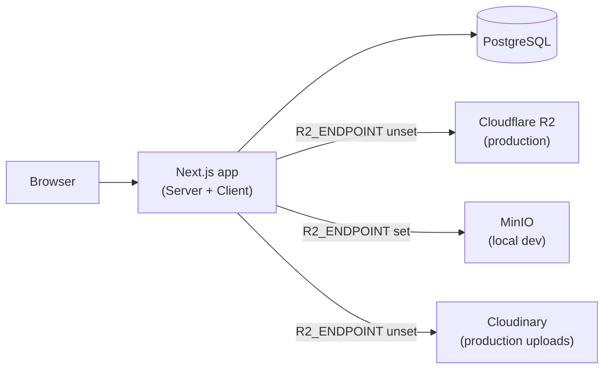

# Project Architecture — Viksphere Site

This document summarizes the architecture, request flows, key files, and useful commands for the Viksphere site.

---
<!-- Editable architecture diagram (Mermaid) -->



---

## Environments

### Local dev (Docker)
Run `docker compose up --build` from the project root. No Node.js or Postgres install required on the host.

| Service  | Host port | Purpose |
|----------|-----------|---------|
| app      | 3000      | Next.js (hot-reload via volume mount) |
| postgres | 5433      | PostgreSQL 16 (host port 5433 to avoid conflicts) |
| minio    | 9000      | S3 API — local replacement for Cloudflare R2 |
| minio    | 9001      | MinIO web console |

**MinIO credentials (dev only):** user `viksphere_dev` / password `viksphere_dev_secret`

The key env var is `R2_ENDPOINT=http://minio:9000`. When this is set:
- `lib/r2.ts` and `lib/adminData.ts` connect to MinIO with `forcePathStyle: true`
- `/api/r2` **streams bytes directly** (no presigned redirect — browser can't reach the internal `minio:9000` hostname)
- `/api/upload` **uploads to MinIO** instead of Cloudinary (Cloudinary is unavailable/skipped inside Docker)

### Production (Cloudflare / Vercel)
`R2_ENDPOINT` is unset. Existing Cloudflare R2 + Cloudinary behaviour is unchanged.

---

## Image request flows

### Local dev (MinIO)
1. UI calls `resolveImage(key)` → returns `/api/r2?key=<key>` (or `/api/` URL as-is if already proxied)
2. Browser requests `/api/r2?key=<key>`
3. Next.js server: `R2_ENDPOINT` is set → `GetObjectCommand` to MinIO → **stream bytes back directly**
4. Browser receives image bytes (status 200)

### Production (Cloudflare R2)
1. Same as above through step 2
2. Next.js server: `R2_ENDPOINT` unset → `getSignedUrl(GetObjectCommand)` → **302 redirect** to presigned R2 URL
3. Browser follows redirect and fetches object directly from R2

### `lib/image.ts` — `resolveImage(src)`
- Returns `src` unchanged if it starts with `/api/` (already proxied — prevents double-encoding)
- Returns `src` unchanged if it's a non-R2 `https://` URL
- Rewrites Cloudflare R2 `https://` URLs to `/api/r2?key=...`
- Routes all other relative paths through `/api/r2?key=<encoded-key>`

---

## Key files and responsibilities

| File | Responsibility |
|------|---------------|
| `lib/r2.ts` | S3 client factory; supports both Cloudflare R2 and MinIO via `R2_ENDPOINT` |
| `lib/adminData.ts` | Read/write JSON blobs (albums, posts, portfolio) from R2/MinIO |
| `lib/image.ts` | `resolveImage()` — normalises any image reference to a browser-safe URL |
| `lib/session.ts` | Iron-session helpers for admin cookie auth |
| `lib/requireAdmin.ts` | Middleware-style helper used by all admin API routes |
| `app/api/r2/route.ts` | Proxy: streams from MinIO (dev) or 302-redirects to R2 presigned URL (prod) |
| `app/api/upload/route.ts` | Image upload: MinIO (dev, when `R2_ENDPOINT` set) or Cloudinary (prod) |
| `app/api/admin/posts/route.ts` | CRUD for LinkedIn posts (stored as `posts.json` in R2/MinIO) |
| `app/api/admin/photos/route.ts` | CRUD for photo albums (stored as `albums.json` in R2/MinIO) |
| `app/api/admin/portfolio/route.ts` | CRUD for portfolio data (`portfolio.json`) |
| `app/sitemap.ts` | Auto-generates `/sitemap.xml` from static routes + R2 album slugs |
| `app/robots.ts` | Auto-generates `/robots.txt`; disallows `/api/`, `/archived/`, admin paths |
| `app/[secret]/admin/` | Admin portal; URL segment comes from `ADMIN_SECRET_KEY` env var |
| `prisma/schema.prisma` | DB schema (ContactMessage actively used; Photo/BlogPost reserved) |
| `data/activities.ts` | Hardcoded static photo album data (legacy, supplemented by admin albums) |
| `Dockerfile` | Dev image: node:20-alpine, installs deps, generates Prisma client |
| `docker-compose.yml` | Full local stack: app + postgres + minio + minio-init |

---

## Admin portal

URL: `http://localhost:3000/<ADMIN_SECRET_KEY>/admin`

Default local credentials (set in `docker-compose.yml`):
- Secret key: `local_dev_secret_key`
- Username: `admin` / Password: `admin_local_password`
- Full URL: `http://localhost:3000/local_dev_secret_key/admin`

### Posts (LinkedIn articles)
- Stored in `posts.json` in R2/MinIO
- Optional **cover image** field — uploaded to MinIO/Cloudinary via `/api/upload`, stored as `coverImage` on the post
- Cover image appears on: homepage feed, `/blog` page

---

## SEO

All major pages export `generateMetadata` or `export const metadata`. Implemented:
- `app/layout.tsx` — `metadataBase`, OG image (`/public/og-cover.jpg`), Twitter card
- `app/vikhyat/page.tsx` — `generateMetadata` + JSON-LD `Person` schema
- `app/blog/page.tsx`, `app/photos/page.tsx`, `app/travel_board/page.tsx`, `app/music/page.tsx`, `app/artifacts/page.tsx` — static metadata
- `app/photos/[slug]/page.tsx` — `generateMetadata` per album
- `app/sitemap.ts` — dynamic sitemap
- `app/robots.ts` — robots.txt

**Manual TODO:** create `/public/og-cover.jpg` at 1200×630px (default social share image).

---

## Environment variables

| Variable | Required | Description |
|----------|----------|-------------|
| `DATABASE_URL` | Yes | Postgres connection string |
| `R2_ACCOUNT_ID` | Prod only | Cloudflare R2 account ID |
| `R2_ACCESS_KEY_ID` | Yes | R2 or MinIO access key |
| `R2_SECRET_ACCESS_KEY` | Yes | R2 or MinIO secret key |
| `R2_BUCKET` | Yes | Bucket name |
| `R2_ENDPOINT` | Dev only | MinIO endpoint e.g. `http://minio:9000`; leave empty for prod |
| `NEXT_PUBLIC_SITE_URL` | Yes | Canonical site URL (used in sitemap, OG tags) |
| `ADMIN_SECRET_KEY` | Yes | URL segment for admin portal |
| `ADMIN_USERNAME` | Yes | Admin login username |
| `ADMIN_PASSWORD` | Yes | Admin login password |
| `SESSION_SECRET` | Yes | 32+ char secret for iron-session cookie |
| `NEXT_PUBLIC_CLOUDINARY_CLOUD_NAME` | Prod only | Skipped when `R2_ENDPOINT` is set |
| `CLOUDINARY_UPLOAD_PRESET` | Prod only | Skipped when `R2_ENDPOINT` is set |

---

## Useful commands

```bash
# Start full local stack (first run builds the image)
docker compose up --build

# Start without rebuilding
docker compose up

# Restart only the Next.js app (pick up code changes if hot-reload lags)
docker compose restart app

# Full reset (removes all volumes including DB and MinIO data)
docker compose down -v

# Run tests (requires local Node.js / or run inside app container)
npm test

# List R2/MinIO objects
node scripts/list-r2.js --all
```

---

## Troubleshooting

| Symptom | Cause | Fix |
|---------|-------|-----|
| `port is already allocated` on 5432 | Local Postgres running | `docker-compose.yml` maps postgres to host port 5433 |
| Image shows broken / wrong URL | `resolveImage` double-encoded `/api/r2` path | Fixed in `lib/image.ts` — `/api/` paths returned as-is |
| Upload fails with `[object Object]` | Cloudinary being called from Docker (reads `.env.local`) | Fixed: `R2_ENDPOINT` check routes directly to MinIO |
| `/api/r2?key=...` returns 500 for missing key | `NoSuchKey` not caught | Fixed: returns 404 for `NoSuchKey`/`NotFound` errors |
| Favicon 500 error | Favicon was hardcoded to `/api/r2?key=favicon.png` | Fixed: now `/favicon.png` from `/public/` |
| Hot reload not picking up changes | File watcher polling lag on Windows+Docker | `docker compose restart app` then hard-refresh browser |


- Ensure the environment on the host has the same `R2_*` env vars.
- For fully static/public image serving, consider populating `NEXT_PUBLIC_IMAGE_BASE` with a CDN URL.
- When hosting on Vercel/Netlify/Cloudflare Pages, add R2 keys to the project's secret env vars and verify serverless function timeout/size when using `@aws-sdk`.

---

If you want, I can also export this Mermaid diagram to a PNG and add it to `docs/architecture.png` as a visual fallback.
